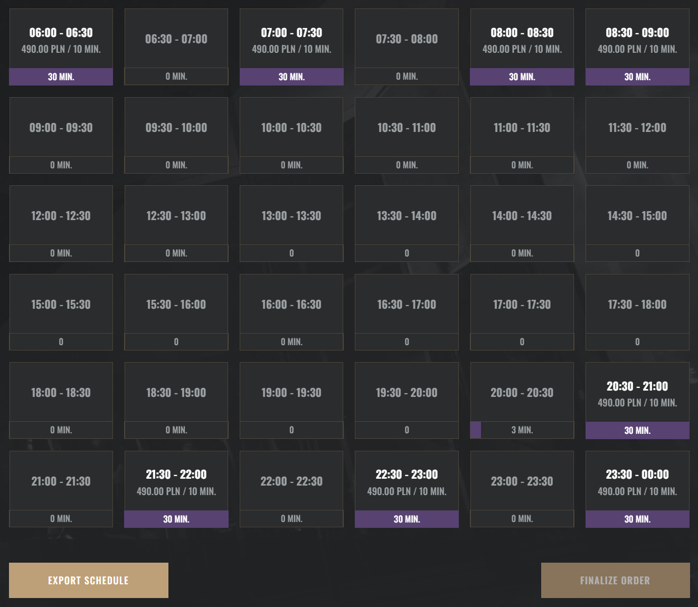

  

    <!--  -->
  

  <h1>Flyspot Schedule Exporter</h1>
  
A Chromium extension that lets you export a text version of the Flyspot booking calendar

  <!-- 

    
  
 -->

  

    Download:
     
    <a>Chrome Web Store</a>
    |
    <a href="https://github.com/EndBug/flyspot-schedule-exporter/releases">GitHub</a>
  

## Screenshots

## Disclaimer

> [!NOTE]  
> This project is not affiliated with Flyspot.
> "Flyspot Schedule Exporter" is an independent project developed by individuals who are affiliated with Flyspot. While the developers may have professional connections to Flyspot, this project has not been authorized, sponsored, or otherwise officially approved by Flyspot.  
> "Flyspot Schedule Exporter" and its creators operate independently and are not directly endorsed by, or in any way officially connected with Flyspot, its subsidiaries, or its affiliates.  
> The official Flyspot website can be found at https://flyspot.com.  
> The name Flyspot, as well as related names, marks, emblems, and images, are registered trademarks of Flyspot.
